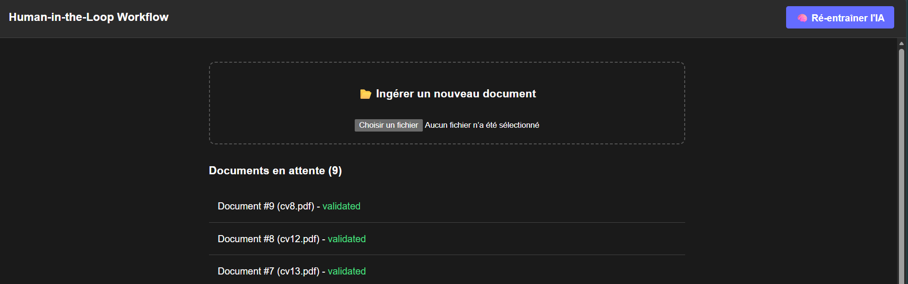
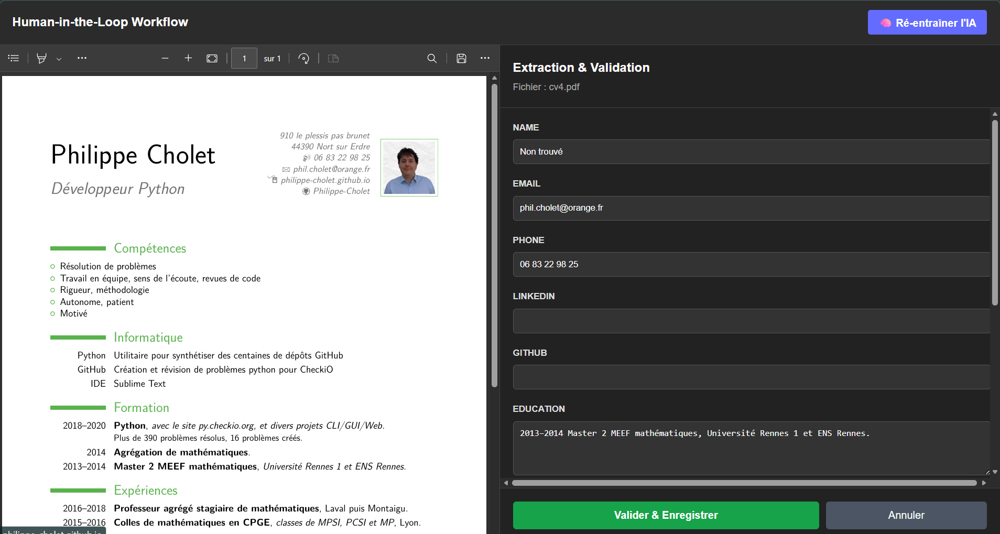
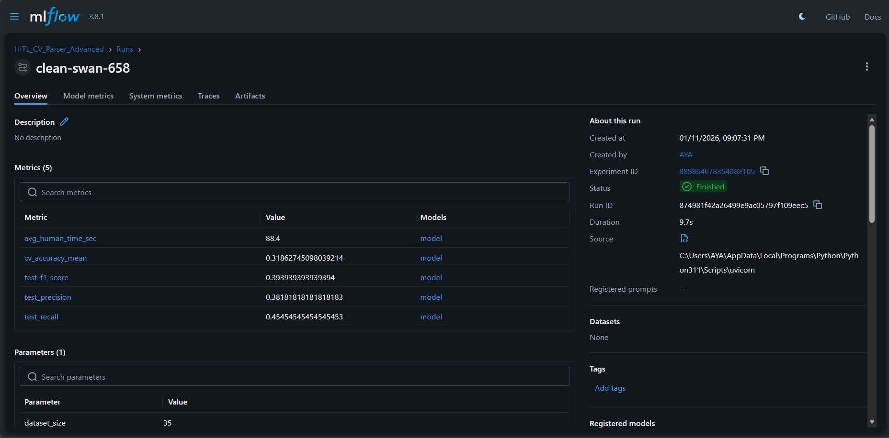
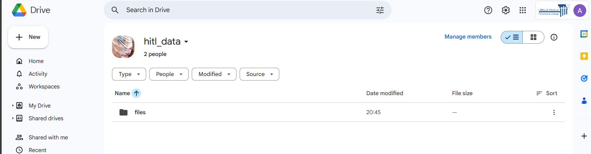

# Project 3: Human-in-the-Loop Workflow (CV Extraction)

This project implements an AI-assisted information extraction system for resumes (CVs). It is built upon the **Human-in-the-Loop** concept: the AI proposes an extraction, the human corrects any errors, and the system retrains itself to improve over time.




## Key Features
- **Ingestion**: PDF file upload (Resumes/CVs).

- **Hybrid Extraction**: Use of Regex/heuristics to pre-fill fields.

- **Human Correction**: "Split-Screen" Interface (PDF viewer on the left, extracted fields form on the right).

- **Continuous Learning**: Retraining pipeline (Scikit-Learn) based on validated corrections.
Metrics: Monitoring of average correction time and model precision to verify learning progress using MLflow.

---

## Prerequisites
Before starting the project, ensure you have the following installed:
* **Python** (3.8 or newer)
* **Node.js** (v14 or newer) & **npm**
* **Git**
* **Docker**


---

## Installation & Setup

The project is divided into two folders: `backend` (Python API) and `frontend` (React Interface). You need to launch two separate terminals:

### 1️⃣ Backend Installation (Terminal 1)

Navigate to the `backend` folder and install the Python dependencies

```bash
# 1. Navigate to backend
cd backend

# 2. Create a virtual environment
# Windows:
python -m venv venv
venv\Scripts\activate

# Mac/Linux:
python3 -m venv venv
source venv/bin/activate

# 3. Install necessary libraries
pip install -r requirements.txt

# 4. Start the API server
uvicorn main:app --reload
```

### 2️⃣ Frontend Installation(Terminal 2)

Navigate to the `frontend` folder and install the Node dependencies.

```bash
# 1. Navigate to frontend
cd frontend

# 2. Install packages
npm install

# 3. Launch the interface
npm run dev
```
The application is now accessible on http://localhost:5173 as indicated in the terminal.

---

## User Guide (Workflow)
To test the full learning cycle:

1. **Upload:** On the homepage, click "Choose File" and select a resume in PDF format.

2. **Correction:** The document appears in the list with a "Pending" status. Click on "Correct".

3. **Validation:**

    *  The AI attempts to fill in the fields (name, email, skills...).

    *  Correct any errors or add missing fields manually.

    *  Click "Validate & Save".
4. **Retraining:** After correcting a variety of CVs, click the "Retrain AI" button in the top right corner to retrain the model so it predicts better next time.

5. **Visualization:** Check MLflow to view improvement metrics.
---

## MLOps & Advanced Configuration

This project integrates **MLflow** for experiment tracking and **DVC** for data version control, ensuring a robust Machine Learning lifecycle.

### 1. MLflow (Experiment Tracking)
Every time you click **"Retrain AI"**, the system logs metrics (Accuracy, Precision, Recall) and artifacts (Confusion Matrix) to MLflow. This allows you to visualize if the model is actually learning from your corrections.

**How to view the Dashboard:**
1. Open a terminal in the `backend` folder.
2. Run the following command:
   ```bash
   mlflow ui
   ```
3. Open your browser and navigate to `http://localhost:5000` as it's indicated in the terminal to access the MLflow dashboard.



The scrreenshot above shows an example of logged experiments with metrics and artifacts.  

### 2. DVC (Data Version Control)
We use DVC to handle large files (like the trained model .pkl, the dataset, uploaded files and the SQLite database) that should not be stored in Git.  
The tracked data is pushed to a Google Drive shared folder.  

  
**How to pull the data:**  
If you are cloning this project for the first time and need the training data/model, you would run:
```bash
dvc pull
```
---

## Project Structure

```bash
/project-root
│
├── /.dvc                     # DVC Configuration Files
│
├── /backend                 # Python API (FastAPI)
│   ├── requirements.txt     # Python Dependencies
│   ├── main.py              # Main API & Routes
│   ├── extraction_engine.py # Regex & PDF parsing logic
│   ├── train_model.py       # ML Pipeline (Scikit-Learn + MLflow)
│   ├── hitl.db              # SQLite Database (Auto-generated)
│   └── model_hitl.pkl       # Trained Model (Auto-generated)
│
├── /frontend                # React Interface
│   ├── src/App.jsx          # Main UI Logic
│   └── package.json         # JS Dependencies
│
├── /screenshots             # Project Screenshots
├── .gitignore               # Git Ignore File
├── .dvcignore               # DVC Ignore File
└── README.md                # Project Documentation
```